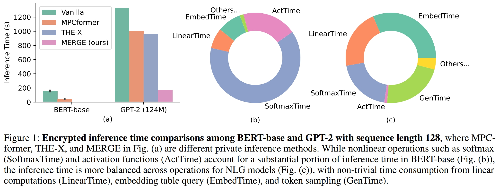

# MERGE: Fast Private Text Generation

This repository is the source code of the paper "MERGE: Fast Private Text Generation"([arxiv link](https://arxiv.org/abs/2305.15769)). MERGE is a framework providing two-party private text generation for existing LMs and LLMs, based on fully homomorphic encryption (FHE) and multi-party computation (MPC) techniques. 
By two optimizations in Transformer model, this framework can achieve a 26.5x speedup under the sequence length 512, and reduce 80\% communication bytes, with an up to 10x speedup to existing state-of-art private inference frameworks.

This repository refers to following two projects:
+ [CrypTen](https://github.com/facebookresearch/CrypTen/tree/main), a MPC package of torch
+ [MPCformer](https://github.com/DachengLi1/MPCFormer), a framework for fast private inference of transformer models
+ [THE-X](https://aclanthology.org/attachments/2022.findings-acl.277.software.zip), a framework for the private inference of transformer models

I reproduce MPCformer and THE-X for three generative language models (GPT series, T5, and Bart) in this repository, which can be seen in [this place](https://github.com/liangzid/MPCGen/tree/master/nlg/transformersV4251/models).

## Introduction of MERGE framework
Recent years have seen increasing concerns about the private inference of NLP services and Transformer models. However, existing two-party privacy-preserving methods solely consider NLU scenarios, while the private inference of text generation such as translation, dialogue, and code completion remains unsolved. Besides, while migrated to NLG models, existing privacy-preserving methods perform poorly in terms of inference speed, and suffer from the convergence problem during the training stage. To address these issues, we propose MERGE, a fast private text generation framework for Transformer-based language models. Specifically, MERGE reuse the output hidden state as the word embedding to bypass the embedding computation, and reorganize the linear operations in the Transformer module to accelerate the forward procedure.
Based on these two optimizations, extensive experiments show that MERGE can achieve a 26.5x speedup under the sequence length 512, and reduce 80\% communication bytes, with an up to 10x speedup to existing state-of-art models.

### Inference Bottleneck of Private Generation



There are four time-consuming operations:
+ Softmax
+ Linear Computation
+ Embedding Layer
+ Sampling and Generation

### MERGE

We propose Embedding Resending (ER) to speedup the auto-regressive generation, and propose the Merge Module (MM) to reduce the inference time of softmax and linear operations.


## Experimental Environments 

This source code is under `python 3.8`and might require`python>=3.8` for your environment.

First `git clone https://github.com/liangzid/MPCGen`, and replace all absolute path such as `/home/liangzi` to your `$HOME` path.

Execute `pip install -r requirments.txt` to install all python packages, where the core packages are as follows:

```
crypten
evaluate
datasets
torch
sklearn
transformers=4.26.0
```

## Performance Experiments


To obtain the fine-tuning results of different backbone under different benchmark, first `cd nlg`, and run `python trains1.py`. in `trains1.py`, you can change the model you want to use as well as the training task:
```python
def main():
    EPOCH = 6
    # LR = 5e-5 
    LR = 5e-5 
    DEVICE = torch.device("cuda:0")
    # DEVICE = torch.device("cpu")
    BATCH_SIZE =32
    batch_size=BATCH_SIZE
    task_ls=["web_nlg","e2e_nlg"]
    subtaskls=["release_v2",None]

    # task="web_nlg"
    # subtask="release_v2"

    # task="e2e_nlg"
    # subtask=None

    task="multiwoz_nlg"
    subtask=None

    # task="daily_dialog"
    # subtask=None

    # task="common_gen"
    # subtask=None
	
	## change to your path
    prefix_path="/home/liangzi/models/"

    # model_name="gpt2/"
    # model_name="t5-small/"
    model_name="bart-base/"
    print(model_name)
    frmpth=prefix_path+model_name
	
	#...
```

To distill the optimization model of baselines and our methods, you need to run `train_slide.py`. Here are some scripts for these experiments in `nlg` directory. For example, this is the distill options of our method:

```sh
export python=/home/liangzi/anaconda3/envs/HE/bin/python3
export root_dir="/home/liangzi/mpcgen/nlg/"

export epochs=3000
export step=50000
# export lr=8e-4
export lr=8e-5
# export lr=3e-4
# export device="cpu"
# export task="web_nlg"
# export task="e2e_nlg"
# export task="multiwoz_nlg"
# export task="common_gen"
export max_seq_length=128

# export batch_size=32
# export task="daily_dialog"
# export teach_ckpt="./stage1_ckpts/${task}-epoch3-lr5e-05-bs4gpt2/"

# export batch_size=16
# export task="multiwoz_nlg"
# export teach_ckpt="./stage1_ckpts/${task}-epoch3-lr5e-05-bs4gpt2/"
# export device="0"

# export batch_size=16
# export task="common_gen"
# export teach_ckpt="./stage1_ckpts/${task}-epoch3-lr5e-05-bs32gpt2/"
# export device="1"

export batch_size=32
export task="multiwoz_nlg"
export teach_ckpt="./stage1_ckpts/multiwoz_nlg-epoch3-lr5e-05-bs4t5-small/"
# export teach_ckpt="./stage1_ckpts/multiwoz_nlg-epoch6-lr5e-5-bs32bart-base"
export device="6"

# export teach_ckpt="./stage1_ckpts/daily_dialog-epoch3-lr5e-05-bs1bart-base/6gpt2/"
# export teach_ckpt="./stage1_ckpts/e2e_nlg-epoch3-lr5e-05-bs4gpt2/fianlly/"

export stu_ckpt=${teach_ckpt}
# export stu_ckpt="./stage1_ckpts/multiwoz_nlg-epoch3-lr5e-05-bs4t5-small/mask500001000104118e-50.010.60.70.75finally/"
# export stu_ckpt=${teach_ckpt}___withConstantMatrix/

export using_entropy=1
export using_softLabel=0
export tau=4
export using_interKL=0
export using_wordEmbedMSE=0
export using_COSEm=1
export using_NEGAEm=0

##############################################################

# ## method 3
# export using_quadacti=0 ##### now add the quadtic option.
# export using_simLN=0
# export lamda=0.75
# export device="7"

# ## method 6
# export using_quadacti=1 ##### now add the quadtic option.
# export using_simLN=1
# export lamda=0.5
# export device="6"

## method 7
export using_quadacti=1 ##### now add the quadtic option.
export using_simLN=1
export no_res=0
export no_softmax=1

# export lamda=0.25
export lamda=0.75

##############################################################

export weight_decay=0.01
export dropout_rate=0.6
export noise=0.75
# export noise=0.2

# export using_wordEmbedMSE=0
export stu_save_ckpt=${stu_ckpt}newModel${step}${using_entropy}${using_softLabel}${using_interKL}${using_wordEmbedMSE}${using_COSEm}${using_NEGAEm}${tau}${using_quadacti}${using_simLN}${lr}${weight_decay}${dropout_rate}${noise}${lamda}

export lonelyLongOverallPath="./distillModelResTest.log"

export board_name=$stu_save_ckpt

${python} train_slide.py \
	--train=1 \
	--no_softmax=1 \
	--epochs=${epochs} \
	--train_step=${step} \
	--lr=${lr} \
	--cuda_num=${device} \
	--batch_size=${batch_size} \
	--task=${task} \
	--max_seq_length=${max_seq_length} \
	--teach_ckpt=${teach_ckpt}\
	--stu_ckpt=${stu_ckpt}\
	--stu_save_ckpt=${stu_save_ckpt}\
	--using_entropy=${using_entropy}\
	--using_softLabel=${using_softLabel}\
	--using_interKL=${using_interKL}\
	--using_wordEmbedMSE=${using_wordEmbedMSE}\
	--using_COSEm=${using_COSEm}\
	--using_NEGAEm=${using_NEGAEm}\
	--tau=${tau}\
	--using_quadacti=${using_quadacti}\
	--using_simLN=${using_simLN}\
	--board_name=${board_name}\
	--weight_decay=${weight_decay}\
	--dropout_rate=${dropout_rate}\
	--dropout_rate=${noise}\
	--lamda=${lamda}\
	--root_dir=$root_dir
```

## Speed Experiments


All code of speed experiments are in `benchmark`, change the variable `method` to evalute related methods, and use the variable `gen_type` to set your generation strategy (vanilla auto-regressive generation, or our ER strategy). You can use `bash evalute_gpt.sh` to execute the private inference of single model, and use `bash vary_msl.sh` and `bash vary_params.sh` to obtain the curves in our paper.

Note: the abosolute inference time might be different in your machine, we have recorded the results on 32GB V100.

## References

```
@misc{liang2023merge,
    title={MERGE: Fast Private Text Generation},
    author={Zi Liang and Pinghui Wang and Ruofei Zhang and Nuo Xu and Shuo Zhang},
    year={2023},
    eprint={2305.15769},
    archivePrefix={arXiv},
    primaryClass={cs.CL}
}
```


